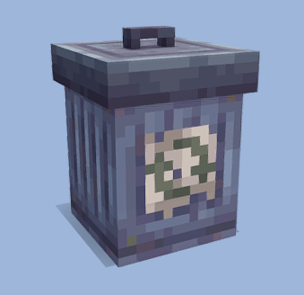

<h1>TrashcanPlus</h1><br>

<b>Trashcan with 3D trashcan model.</b><br>
This plugin is based on [Trashcan Addon](https://mcpedl.com/trashcan-addon/) on MCPEDL<br><br>
[](https://github.com/brokiem/Trashcan)
[](https://github.com/brokiem/Trashcan/stargazers)
[](https://discord.com/invite/jy6abSrjhQ)
[](https://poggit.pmmp.io/p/TrashcanPlus)

## 💬 Commands

| Command                                   | Description                   | Permission             | Default    |
|-------------------------------------------|-------------------------------|------------------------|------------|
| ```/trashcan```                           | ```Trashcan command```        | ```none```             | ```true``` |
| ```/trashcan help```                      | ```Trashcan help command```   | ```none```             | ```true``` |
| ```/trashcan spawn [optional: nametag]``` | ```Spawn trashcan entity```   | ```trashcan.spawn```   | ```op```   |
| ```/trashcan despawn```                   | ```Despawn trashcan entity``` | ```trashcan.despawn``` | ```op```   |

## ❔ Issues

Did you find a bug or error when using this plugin? feel free to open the
issues [here](https://github.com/brokiem/Trashcan/issues/new)

## 👑 Donation

Paypal - https://paypal.me/brokiem <br>
Saweria - https://saweria.co/brokiem

## 🌟 Credits

This plugin is based on [Trashcan Addon](https://mcpedl.com/trashcan-addon/) on MCPEDL<br>
Icon taken from [Sketchfab](https://sketchfab.com/3d-models/trash-can-minecraft-831dd489b8044ba8bb77f0ca253dcfde) by
sedona1029
